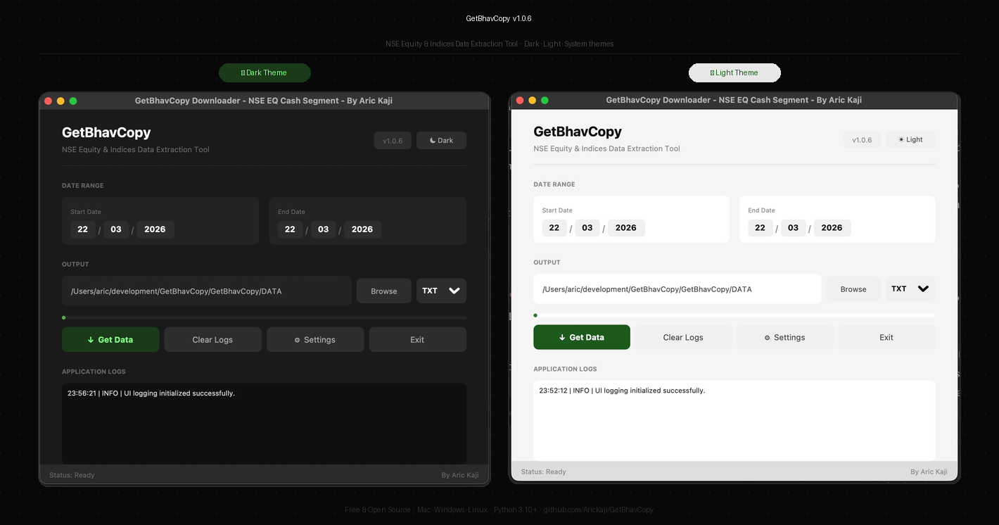

# GetBhavCopy

> Download NSE equity and indices bhavcopy data in seconds — on Mac, Windows and Linux.

[](https://www.python.org/)
[](LICENSE)
[]()
[](https://github.com/astral-sh/ruff)
[](https://buymeacoffee.com/AricKaji)



## What is GetBhavCopy?

GetBhavCopy is a desktop tool that downloads NSE (National Stock Exchange India) bhavcopy data for equity and indices. It is built for traders who use tools like AmiBroker and need clean, reliable OHLCV data — without manually visiting the NSE website every day.

It downloads data in parallel using multithreading, skips weekends and holidays automatically, and saves files in a format ready to import directly into AmiBroker or any other charting platform.

---

## Features

- **Equity & Indices** — downloads both NSE equity (`sec_bhavdata_full`) and index (`ind_close_all`) bhavcopy data in one click
- **Date range** — pick any start and end date, including multi-day ranges spanning weeks or months
- **Parallel downloads** — uses up to 8 concurrent threads for fast multi-day downloads
- **Symbol mapping** — rename any NSE symbol or index to match your tool's naming convention (e.g. `Nifty 50 → NIFTY50`)
- **Skip existing** — skips dates that already have a file in your output folder, so re-running is safe
- **TXT & CSV** — export in either format, compatible with AmiBroker and most trading platforms
- **Dark & Light theme** — follows your system theme automatically, with a manual toggle to override
- **Cross-platform** — works on macOS, Windows and Linux
- **Colour coded logs** — real-time download progress with green/orange/red log output

---

## Output Format

Each downloaded file contains one row per symbol with these columns — no header:

```
SYMBOL,DATE,OPEN,HIGH,LOW,CLOSE,VOLUME
```

Example:

```
RELIANCE,20260302,1055.0,1094.8,1048.2,1074.7,1837718
NIFTY 50,20260302,22000.0,22200.0,21800.0,22100.0,500000
```

Files are named by date:
- `bhavcopy_2026-03-02.txt` (TXT format)
- `bhavcopy_2026-03-02.csv` (CSV format)

---
## Download

| Platform | Download | Notes |
|---|---|---|
| Windows | [GetBhavCopy-windows.zip](https://github.com/AricKaji/GetBhavCopy/releases/latest) | No Python required |
| macOS | [GetBhavCopy-mac.zip](https://github.com/AricKaji/GetBhavCopy/releases/latest) | No Python required |
| Linux | Install from source | See below |

## Installation

### Requirements
- Python 3.10 or higher
- pip

### Install from source

```bash
git clone https://github.com/AricKaji/GetBhavCopy.git
cd GetBhavCopy
pip install -e .
```

### Run

```bash
python -m getbhavcopy
```

Or run directly:

```bash
python src/getbhavcopy/ui.py
```

---

## Usage

1. Launch the app
2. Set your **Start Date** and **End Date** using the date fields — the cursor moves automatically between day, month and year
3. Choose your **Output Folder** using the Browse button
4. Select **TXT** or **CSV** format from the dropdown
5. Click **↓ Get Data**

The app downloads bhavcopy files for all trading days in the selected range. Weekends are skipped automatically. If a date's data is unavailable (NSE holiday or network issue), it is logged as a warning and skipped.

---

## Symbol Mapping

Symbol mapping lets you rename any NSE symbol or index in your output files without changing the source data. This is useful when your charting tool expects a specific naming convention.

**To add a mapping:**

1. Click **⚙ Settings** in the main window
2. Click **+ Add Row**
3. Enter the original NSE name on the left and your custom name on the right
4. Click **Save**

All future downloads will use your custom names automatically.

**Example mappings:**

| Original Name (NSE) | Custom Name |
|---|---|
| Nifty 50 | NIFTY50 |
| Nifty Bank | BANKNIFTY |
| RELIANCE | REL |
| 1018GS2026 | Aric-1018GS2026 |

Mapping is stored at:
- **Windows:** `%APPDATA%\GetBhavCopy\symbol_mapping.json`
- **Mac / Linux:** `~/.getbhavcopy/symbol_mapping.json`

---

## Configuration

All settings are saved automatically and restored on next launch.

| Setting | File | Default |
|---|---|---|
| Output folder path | `SaveDirPath.json` | Current working directory |
| Output format (TXT/CSV) | `SaveDirPath.json` | TXT |
| Theme (dark/light/system) | `SaveDirPath.json` | System |
| Symbol mapping | `symbol_mapping.json` | Empty |

Config files are stored at:
- **Windows:** `%APPDATA%\GetBhavCopy\`
- **Mac / Linux:** `~/.getbhavcopy/`

Logs are written to `getbhavcopy.log` in the same directory with automatic rotation (5 MB max, 3 backups).

---

## Project Structure

```
GetBhavCopy/
├── src/
│   └── getbhavcopy/
│       ├── __init__.py           # Package entry point
│       ├── core.py               # Download engine, threading, NSE API
│       ├── ui.py                 # Main window (customtkinter)
│       ├── settings_windows.py   # Symbol mapping settings window
│       └── logging_config.py     # Rotating file logger setup
├── tests/
│   └── test_getbhavcopy.py       # Unit tests (pytest)
├── docs/
│   └── assets/
│       ├── screenshot-hero.png
│       ├── screenshot-dark.png
│       └── screenshot-light.png
├── pyproject.toml
├── requirements.txt
└── README.md
```

---

## Development

### Setup

```bash
git clone https://github.com/AricKaji/GetBhavCopy.git
cd GetBhavCopy
pip install -e ".[dev]"
pre-commit install
```

### Run tests

```bash
pytest
```

### Run pre-commit checks

```bash
pre-commit run
```

### Tech stack

| Tool | Purpose |
|---|---|
| `customtkinter` | UI framework — dark/light theme, cross-platform |
| `pandas` | CSV parsing and data manipulation |
| `requests` | HTTP downloads from NSE archives |
| `threading` | Parallel downloads via `ThreadPoolExecutor` |
| `ruff` | Linting and formatting |
| `mypy` | Static type checking |
| `pytest` | Unit tests |
| `pre-commit` | Automated code quality checks |

---

## Changelog

### v1.0.9 — April 2026
- Settings window completely redesigned with sidebar navigation
- Symbol Mapping and Performance sections in dedicated panels
- Tab switching fixed — instant, no delay, no black screen
- Scheduler, Output and Appearance sections coming in future releases
- Max workers slider in Performance panel
- Mapping count badge in sidebar nav

### v1.0.8 — March 2026
- Auto-update checker — silent background check on startup
- Update banner with version info and dismiss button
- What's new popup — shows formatted release notes from GitHub
- Direct download — downloads and extracts correct platform build to Downloads folder

### v1.0.7 — March 2026
- Mac .app bundle — no Python required
- Windows .exe — no Python required
- Automated GitHub Actions build pipeline for both platforms
- Platform download section added to website
- Buy Me a Coffee support link added
- GitHub FUNDING.yml sponsor button
- CLI entry point — launch with `python -m getbhavcopy`
- PyPI packaging metadata and LICENSE file

### v1.0.6 — March 2026
- Full UI redesign with customtkinter
- Dark and light theme toggle with system detection via `darkdetect`
- Settings window follows main window theme
- Symbol mapping settings window with scrollable table
- Colour coded log output — green for success, orange for warnings, red for errors
- Shorter timestamp format in UI logs
- Cross-platform font support — SF Pro (Mac), Segoe UI (Windows), Ubuntu (Linux)
- Parallel downloads with configurable thread count
- Progress bar, status bar, folder picker

### v1.0.0 — Initial release
- NSE equity bhavcopy download
- NSE indices bhavcopy download
- Date range selection with auto-advancing cursor
- TXT and CSV export
- AmiBroker compatible OHLCV output
- Symbol mapping for custom naming
- Rotating file logger

---

## Contributing

Contributions are welcome. Please open an issue first to discuss what you would like to change.

1. Fork the repo
2. Create a feature branch — `git checkout -b feature/your-feature`
3. Make your changes and add tests if applicable
4. Run checks — `pre-commit run` and `pytest`
5. Open a pull request against `main`

---

## License

MIT — see [LICENSE](LICENSE) for details.

---

Built by [Aric Kaji](https://github.com/AricKaji) — for traders who want reliable NSE data without the hassle.
